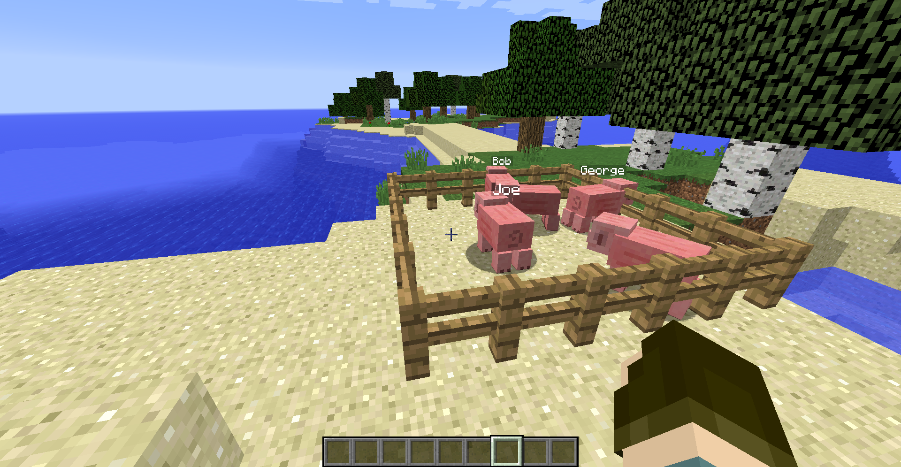

# Modern Info

This is a 1.8.9 mod for showing information typically available in future versions of Minecraft.

In specific the mod does these three things:

For some reason, in vanilla, the bow's last sprite displays when the bow is 90% charged. This mod shows a charge bar that turns red (or another configurable color) when fully charged. In future versions, you can use a resource pack to mimic this functionality on the bow texture.

There is also a hit marker that shows you if you can hit a non-player entity (configurable), which turns red (configurable color) when you can crit. Technically critical hit information is not available normally, but it's basically common knowledge that you crit while falling at this point.

Finally, this mod makes custom names always visible, rather than visible only on the entity you're looking at.

Mostly everything in this mod can be configured or disabled in-game through the config menus.

This mod will not be ported to any other versions.

## Contact

Contact me on [Discord](https://discord.gg/pBFqEcXvW5) and support me on [Ko-Fi](https://ko-fi.com/mathgeniuszach)!

## Screenshots

